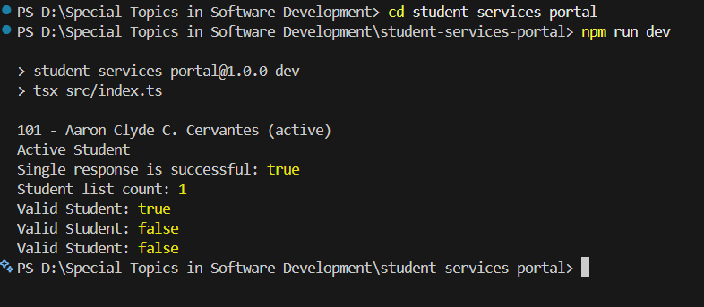
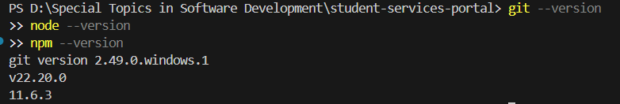
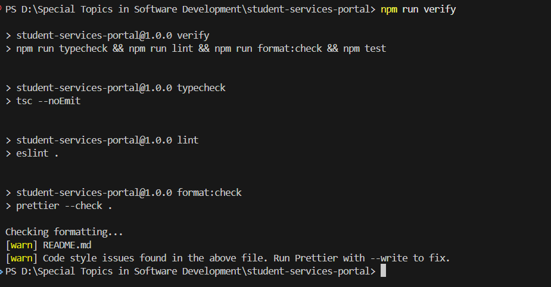
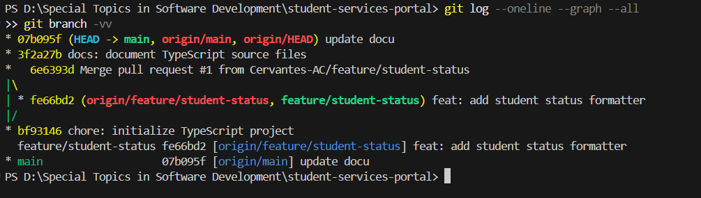

# University Student Services Portal

A TypeScript starter project for the University Student Services Portal. It demonstrates typed student data, generic API responses, runtime validation for untrusted data, and a safe student-status formatter.

## Requirements

- Node.js 22 or later
- npm 11 or later
- Git

## Installation

```bash
git clone <your-repository-url>
cd student-services-portal
npm install
```

## Run the project

```bash
npm run dev
```

## Quality checks

```bash
npm run typecheck
npm run lint
npm run format
npm test
npm run verify
```

`format` changes files; use `format:check` when a non-mutating format check is needed.

## Development workflow

1. Create a GitHub Issue describing the work and acceptance criteria.
2. Create a focused branch, such as `feature/student-status`.
3. Implement, understand, test, lint, format, and verify the change locally.
4. Make a meaningful commit, push the branch, and open a pull request linked to the issue.
5. Address review feedback before merging the approved pull request into `main`.

## AI usage policy

AI tools may assist development, but generated suggestions are not committed blindly. Each suggestion must be understood, reviewed, adjusted where appropriate, tested, and verified against official documentation before it is committed. The AI record and verification notes for this laboratory are in [documentation/LABORATORY_REPORT.md](documentation/LABORATORY_REPORT.md).

## Screenshots








## Reflection

### 1. What was the most important difference between your previous programming workflow and the Git/GitHub workflow used in this laboratory?

Previously, changes could remain only on one computer and be difficult to explain later. Git records intentional snapshots with meaningful messages, while GitHub gives the team a shared place to discuss and review them. This workflow makes the reason for a change as visible as the code itself.

### 2. Why was the feature branch useful?

The feature branch isolated the status formatter from the stable `main` branch. I could test and revise the feature without mixing it with unrelated work. It also created a clear unit of review for the pull request.

### 3. Did the AI provide any suggestion that required modification? Explain.

The original typed formatter could accept only `StudentStatus`, which is appropriate for already validated values. I modified its parameter to `unknown` so it can safely handle an unexpected value supplied at runtime. The default result now communicates an unknown status instead of assuming that every value is valid.

### 4. How did TypeScript help detect or prevent a possible problem?

The `StudentStatus` union limits typed status values to `active` and `inactive`. The generic API response retains whether its payload is one student or an array of students. These checks make accidental misuse visible during development instead of after deployment.

### 5. Why was runtime validation still necessary?

Type annotations are removed from JavaScript when the project runs. An API or form can still provide a string for an id or omit a required property. The `isStudent` guard checks the real value before the application treats it as a student.

### 6. What information should never be placed in the repository?

Passwords, API keys, access tokens, and private configuration must never be committed. Personal data and production database exports also require careful handling and usually do not belong in source control. The `.env` rule helps prevent a common accidental secret disclosure.

### 7. Which step of Ask → Understand → Review → Modify → Test → Verify → Commit was the most important to you?

Testing was the most important step because it gave evidence that the formatter handles both expected and unexpected values. It also checked the runtime validator's positive and negative cases. Testing makes an AI suggestion accountable to observable behavior rather than trusting its wording.

### 8. How could this workflow improve a group software-development project?

Issues make tasks and acceptance criteria visible before coding begins. Branches and pull requests let teammates review a focused change without interrupting other development. Shared linting, formatting, tests, and documented AI use create consistent standards across the project.
